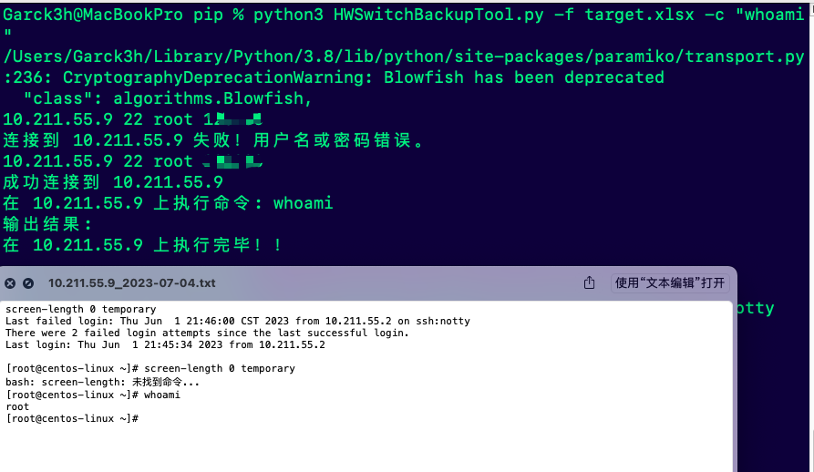

# 华为交换机批量备份配置文件
## 前言

有个朋友找到我，说能不能写个脚本实现，批量把华为交换机的配置进行备份，于是乎便有了这个脚本。

## 实现原理
1.使用pandas模块批量读取Excel表格的内容，包括IP、端口、账号、密码

2.对读取的资产进行遍历执行ssh连接

3.ssh连接之后，执行命令"dis cu"

4.然后把内容存为txt，以IP已经当天的日期进行命名

5.遇到的难题是因为执行这个命令需要多执行几次回车或者空格才能把内容全部显示出来。于是使用了命令：screen-length 0 temporary 来临时禁止分页，一次性将命令的输出。然后通过循环读取结果即可。

## 用法
\-f, --file, 连接信息的Excel文件路径

 -c, --command，需要执行的命sss令

例如：

```python
python HWSwitchBackupTool.py -f target.xlsx -c "dis cu"
```



